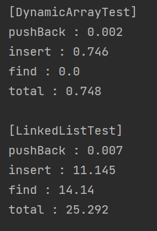

# Dynamic Array vs LinkedList for List
Dynamic array를 이용한 List와 LinkedList를 이용한 List의 간단한 속도 측정 테스트입니다.  
&nbsp;  

### Description (1st TEST)
테스트는 pushBack, insert, find의 시간 측정입니다. _max/2_ 만큼 데이터를 끝에 순차 삽입하는 시간을 측정하고,
_max/2_ 만큼 임의의 위치에 데이터를 삽입하는 시간을 측정한 후, 해당 위치를 탐색하는 시간을 측정합니다.  
1. Dynamic array  
- pushBack : Array의 크기는 2로 시작하며, 크기가 꽉차면 2배씩 증가합니다.
- insert : 삽입 인덱스 이후의 데이터는 shift하며, 크기가 꽉차면 2배씩 증가합니다.
- find : 해당 인덱스의 데이터를 읽습니다.
2. LinkedList  
- pushBack : Node를 생성하여 rear.next에 추가하고, 해당 Node가 rear가 됩니다.
- insert : Node를 생성하여 삽입 인덱스만큼 앞에서 순차탐색하고, 인덱스의 노드 -> 생성 Node -> 인덱스의 노드.next로 설정합니다.
- find : 해당 인덱스만큼 앞에서 순차탐색을 합니다.  
&nbsp;  

### Conclusion (1st TEST)
_max_ 가 100_000일 때, 결과는 다음과 같습니다:  
  

1. pushBack  
- Dynamic Array가 근소하게 빠릅니다.
- Array의 크기 증가로 인한 copy 오버헤드에도 불구하고, LinkedList의 동적 할당 시간이 더 소요되는 듯 합니다.
2. insert  
- Dynamic Array가 월등히 빠릅니다.
- 크기 증가 + shift 오버헤드에도 불구하고, LinkedList의 삽입이 매우 느립니다.
3. find  
- Dynamic Array가 월등히 빠릅니다.
- Dynamic Array는 인덱스로 바로 접근하지만(O(1)), LinkedList는 순차탐색을 합니다.
- find는 insert보다 데이터양이 증가하였으므로 insert보다 느립니다.  
&nbsp;  

### 의문점
그런데 비슷하게 동작하는 Java의 Collection.ArrayList와 Collection.LinkedList에서는 LinkedList의 insert가 훨씬 빠르다고 합니다.  
삽입에 사용하는 [LinkedList의 add()](https://docs.oracle.com/javase/7/docs/api/java/util/LinkedList.html#add(int,%20E))를 보면 다음과 같이 구현되어 있으며,
이를 통해 **탐색이 최대 N/2만큼 진행되는 것** 외에는 위 테스트 insert 과정이 비슷해보입니다.  

```java
// LinkedList::add
public void add(int index, E element) {
        checkPositionIndex(index);

        if (index == size)
            linkLast(element);
        else
            linkBefore(element, node(index));
    }
```  
```java
// LinkedList::node
Node<E> node(int index) {
        // assert isElementIndex(index);

        if (index < (size >> 1)) {
            Node<E> x = first;
            for (int i = 0; i < index; i++)
                x = x.next;
            return x;
        } else {
            Node<E> x = last;
            for (int i = size - 1; i > index; i--)
                x = x.prev;
            return x;
        }
    }
```

