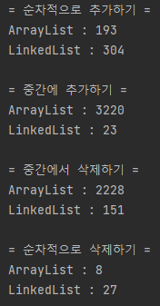
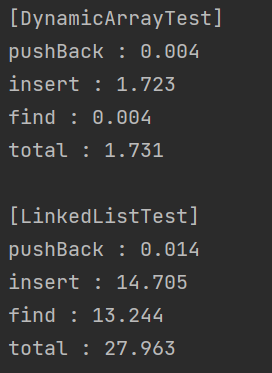
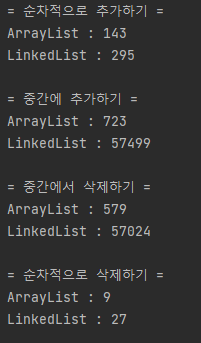
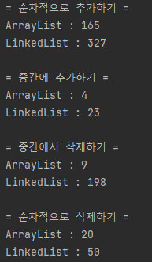

### 동기
[Dynamic Array vs LinkedList for List 테스트](https://github.com/pythaac/Performance_Test/tree/main/Dynamic_Array_vs_LinkedList_for_List)에서 LinkedList에 비해 Dynamic Array의 
삽입이 빠른 것을 확인했습니다. 그런데 [Java의 정석 코드](https://github.com/castello/javajungsuk3/blob/master/source/ch11/ArrayListLinkedListTest.java)에 따르면 비슷하게 동작하는 Java의 **Collection.ArrayList와 Collection.LinkedList에서는 LinkedList의 insert가 훨씬 빠르다고 합니다.** 이 원인을 확인하기 위해 테스트를 진행하였습니다.  
  
&nbsp;  
___

### 분석1: LinkedList의 탐색 
Collection.LinkedList에서 삽입에 사용하는 [LinkedList의 add()](https://docs.oracle.com/javase/7/docs/api/java/util/LinkedList.html#add(int,%20E))를 보면 다음과 같이 구현되어 있으며,
이를 통해 **탐색이 최대 N/2만큼 진행되는 것** 외에는 이전 테스트 insert 과정이 비슷해보입니다.

```java
// LinkedList::add
public void add(int index, E element) {
        checkPositionIndex(index);

        if (index == size)
            linkLast(element);
        else
            linkBefore(element, node(index));
    }
```  
```java
// LinkedList::node
Node<E> node(int index) {
        // assert isElementIndex(index);

        if (index < (size >> 1)) {
            Node<E> x = first;
            for (int i = 0; i < index; i++)
                x = x.next;
            return x;
        } else {
            Node<E> x = last;
            for (int i = size - 1; i > index; i--)
                x = x.prev;
            return x;
        }
    }
```  
&nbsp;  

### 변경사항1
우선 확인된 내용을 확인하기 위해, SecondLinkedListTest에는 doubly linkedlist로 변경하여, index가 head와 rear중 더 가까운 곳부터 탐색하도록 수정하였습니다.  

2. LinkedList  
- insert : Node를 생성하여 head와 rear중 인덱스가 더 가까운 곳에서 탐색하고, 인덱스의 노드 <-> 생성 Node <-> 인덱스의 노드.next로 설정합니다.
- find : head와 rear중 해당 인덱스와 가까운 곳부터 순차탐색합니다.  
&nbsp;  

### 결과1
_max_ 가 100_000일 때, 결과는 다음과 같습니다:  
  

아쉽지만 차이점이 보이지 않습니다. 위 Java의 정석 코드에서 Collection.LinkedList의 삽입 속도가 빠른 원인은 이 테스트에서 추가한 내용이 아닙니다.
&nbsp;  
___

### 분석2: 테스트의 대상 인덱스
Java의 정석에 나온 코드를 다시 살펴보니, 테스트가 다음과 같은 특징을 가지고 있습니다.
- add1 : 1_000_000 개의 원소를 마지막 위치에 저장
- add2 : **인덱스 500** 에 10_000번 원소를 삽입
- remove2 : **인덱스 0부터 10_000-1까지** 순차적으로 삭제
- remove1 : 모든 원소를 마지막 위치부터 삭제  

add2에서 1_000_000개의 원소를 가진 리스트에 <u>인덱스 500은 앞에 가깝습니다</u>. 
remove2에서 <u>인덱스 0 ~ 10_000-1 또한 앞에 가까운 인덱스입니다</u>.  
&nbsp;  

### 변경사항2
[이 코드](https://github.com/pythaac/Performance_Test/blob/main/Dynamic_Array_vs_LinkedList_for_List_2/src/com/company/ChangedTest.java)에서 Java의 정석 코드에서 add2와 remove2의 인덱스를 length/2로 수정하여 테스트해보았습니다.  
- add2 : **중앙** 에 10_000번 원소를 삽입
- remove2 : **중앙** 원소를 10_000번 삭제  
&nbsp;  

### 결과2
아래와 같이 Collection.LinkedList가 더 느려진 것을 확인하였습니다.  
  
&nbsp;  
___

### 변경사항3
[이 코드](https://github.com/pythaac/Performance_Test/blob/main/Dynamic_Array_vs_LinkedList_for_List_2/src/com/company/ChangedTest2.java)에서는 Java의 정석 코드와 반대로, 인덱스를 뒤에 가깝도록 수정해보았습니다.
- add2 : **인덱스 length-500** 에 10_000번 원소를 삽입
- remove2 : **인덱스 length-1-(0~10_000)** 원소를 순차적으로 삭제  
&nbsp;  

### 결과3
아래와 같이 ArrayList가 더 빠르지만, 큰 차이가 없는 것을 확인하였습니다.  
  

### 결론
이 테스트를 통해 확인한 Array와 LinkedList의 삽입/삭제 특징은 다음과 같습니다.  
1. 삽입/삭제 인덱스가 **앞쪽**일수록 LinkedList가 빠르다.  
- Array는 삽입/삭제 대상이 앞쪽일수록 shift할 데이터 양이 많아진다.
- LinkedList는 삽입/삭제 대상이 중앙에서 멀어질수록 대상을 빠르게 탐색한다.
2. 삽입/삭제 인덱스가 **중앙**일수록 Array가 빠르다.
- Array에서 shift할 데이터 양은 N/2이다.
- LinkedList가 삽입/삭제 대상을 찾기위해 N/2만큼 탐색한다.
3. 삽입/삭제 인덱스가 **뒤쪽**일수록 비슷하다.
- Array는 삽입/삭제 대상이 뒤쪽일수록 shift할 데이터 양이 적어진다.
- LinkedList는 삽입/삭제 대상이 중앙에서 멀어질수록 대상을 빠르게 탐색한다.
