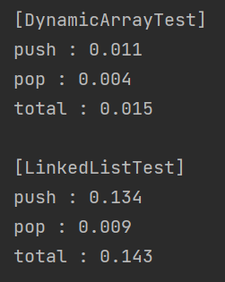

# Dynamic Array vs LinkedList for Stack
Dynamic array를 이용한 Stack과 LinkedList를 이용한 Stack의 간단한 속도 측정 테스트입니다.  
&nbsp;  

### Description
테스트는 push, pop 시간 측정입니다. _max_ 만큼 데이터를 push 시간을 측정하고,
_max_ 만큼 데이터를 pop하는 시간을 측정합니다.  
1. Dynamic array  
- Push : Array의 크기는 2로 시작하며, 크기가 꽉차면 2배씩 증가합니다.
- Pop : top을 pop하고 top--합니다.
2. LinkedList  
- Enqueue : Node를 생성하여 top을 rear.before에 추가하고, 현재 노드를 top으로 변경합니다.
- Dequeue : top를 top.before로 변경합니다.  
&nbsp;  

### Conclusion
_max_ 가 1_000_000일 때, 결과는 다음과 같습니다:  
  

1. Push  
- Dynamic Array가 더 빠릅니다.
- Array의 크기 증가로 인한 copy 오버헤드에도 불구하고, LinkedList의 동적 할당 시간이 더 소요되는 듯 합니다.
2. Pop  
- Dynamic Array가 근소하게 빠릅니다.  
- Queue에서 Dynamic Array가 shift가 필요한 반면, Stack에서는 필요하지 않으므로 오버헤드 차이가 크지 않습니다.
